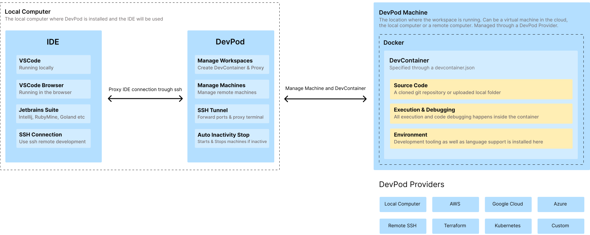

## DevPod

### **[Website](https://www.devpod.sh)** • **[Quickstart](https://www.devpod.sh/docs/getting-started/quickstart)** • **[Documentation](https://www.devpod.sh/docs/what-is-devpod)** • **[Blog](https://loft.sh/blog)** • **[Twitter](https://twitter.com/loft_sh)** • **[Slack](https://slack.loft.sh/)**

DevPod is a tool to create reproducible developer environments. Each developer environment runs in a separate container and is specified through a [devcontainer.json](https://containers.dev/). Through [DevPod providers](./managing-providers/what-are-providers) these containers can be created on the local computer, any reachable remote machine or in a public or private cloud. It's also possible to extend DevPod and write your own custom providers.

You can of DevPod as the glue that connects your local IDE to a machine where you want to develop on. So depending on the requirements of your project, you can either create a workspace locally on the computer, on a beefy cloud machine or a spare remote computer. Within DevPod, every workspace is managed the same way, which also makes it easy to switch between workspaces that might hosted somewhere else.

 

## Why DevPod?

DevPod reuses the open [DevContainer standard](https://containers.dev/) to create a consistent developer experience no matter what backend you want to use.

Compared to hosted services such as Github Codespaces, Jetbrains Spaces or Google Cloud Workstations, DevPod has the following advantages:
* **Cost savings**: DevPod is usually around 5-10 times cheaper than existing services with comparable feature sets, because it uses bare virtual machines.
* **No vendor lock-in**: Choose whatever cloud provider suits you best, be it the cheapest one or the most powerful, DevPod supports all cloud providers. If you are tired of using a provider, change it with a single command.
* **Local development**: You get the same developer experience also locally, so you don't need to rely on a cloud provider at all.
* **Cross IDE support**: VSCode and the full Jetbrains suite is supported, all others can be connected through simple ssh.
* **Client-only**: No need to install a server backend, DevPod runs solely on your computer.
* **Open-Source**: DevPod is 100% open-source and extensible. A provider doesn't exist? Just create your own.
* **Rich feature set**: DevPod already supports prebuilds, auto inactivity shutdown, git & docker credentials sync and many more features to come.
